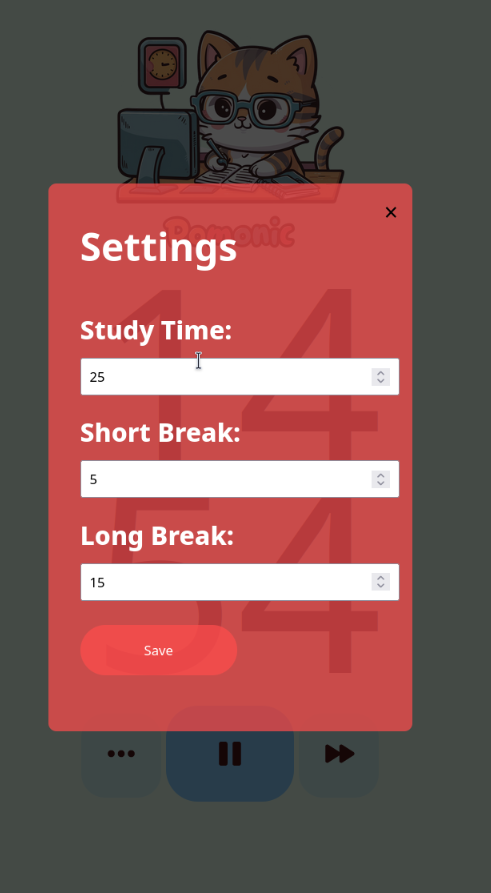
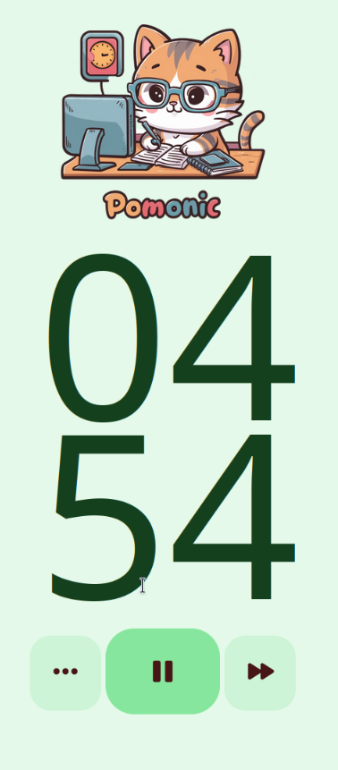

<div align="center">
  
  
  
</div>

<p align="center">Simple and visually-pleasing Pomodoro timer.</p>
<div align="right">
  
</div>

# Pomonic
[https://pomonic-vue.vercel.app/](https://pomonic-vue.vercel.app/)<br>
**Pomonic** is a web application designed to help you manage your time effectively using the Pomodoro Technique. This technique involves working in focused intervals, followed by breaks, to maximize productivity and maintain focus.

## Features

- **Customizable Times**: Adjust focus and break times to fit your needs.
- **Optional Desktop Notifications**: Receive alerts on your desktop to remind you of focus and break periods.


## Installation

1. **Clone the Repository**

   ```bash
   git clone https://github.com/gustapavao/pomonic-vue.git
   cd pomonic-vue
   ```

2. **Install Dependencies**

   Make sure you have [Node.js](https://nodejs.org/) installed. Run:

   ```bash
   npm install
   ```

3. **Start the Development Server**

   ```bash
   npm start
   ```

   Open your browser and go to [http://localhost:3000](http://localhost:3000) to use the Pomonic-vue.

OR 
You can acess [https://pomonic-vue.vercel.app/](https://pomonic-vue.vercel.app/) to use it.

## Contributing

Feedback and contributions are welcome! If you would like to contribute to the development of Pomonic, please follow these steps:

1. **Fork the Repository**

2. **Create a Branch for Your Feature**

   ```bash
   git checkout -b my-new-feature
   ```

3. **Commit Your Changes**

   ```bash
   git commit -am 'Add new feature'
   ```

4. **Push to the Repository**

   ```bash
   git push origin my-new-feature
   ```

5. **Open a Pull Request**

   Open a Pull Request to have your changes reviewed and merged into the main project.

## License

Distributed under the [MIT License](LICENSE).
